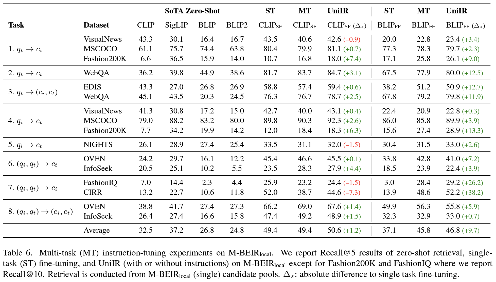
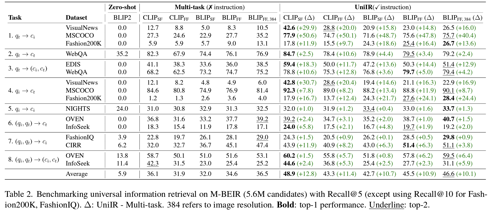

# UniIR

[**🌐 Homepage**](https://tiger-ai-lab.github.io/UniIR/) | [**🤗 Dataset(M-BEIR Benchmark)**](https://huggingface.co/datasets/TIGER-Lab/M-BEIR) | [**🤗 Checkpoints(UniIR models)**](https://huggingface.co/TIGER-Lab/UniIR) | [**📖 arXiv**](https://arxiv.org/pdf/2311.17136.pdf) | [**GitHub**](https://github.com/TIGER-AI-Lab/UniIR)

This repo contains the codebase for the ECCV-2024 paper "[UniIR: Training and Benchmarking Universal Multimodal
Information Retrievers](https://arxiv.org/pdf/2311.17136.pdf)"

Note that there are two retrieval pools: (1) The pool from the correponding dataset. For example, MSCOCO results are ranked within the MSCOCO dataset only. (2) The pool is the UNION of all datasets. For example, MSCOCO results are ranked within the entire benchmark of all datasets. Since we skip large datasets at present, the UNION pool is incomplete and the first case is reported for consistency.

The number at the beginning of the dataset is used to indicate the type of the retrieval shown in the oirginal table. For example, 1. MSCOCO indicates the first type of task $q_t \rightarrow c_i$ and 4. MSCOCO indicates $q_i \rightarrow c_t$.

<!-- 

|        | 1. MSCOCO | 4. MSCOCO | 4. Fashion200K | 5. NIGHTS | 8. FashionIQ | 8. CIRR |
|--------|-----------|-----------|----------------|-----------|--------------|---------|
| **R1** | 0.444     | 0.3658    | 0.0385         | 0.0448    | 0.0775       | 0.1376  |
| **R5** | 0.7058    | 0.6474    | 0.0593         | 0.1797    | 0.1066       | 0.335   |
| **R10**| 0.8007    | 0.7576    | 0.11           | 0.3066    | 0.1573       | 0.4357  |  -->

## Benchmark Results
### UniIR in Local Pools


### UniIR in Global Pools


## Update Nov 20, 2024

We have trained a new model using codes from `xtuner/llava-phi-3-mini-hf`, which LLaVA variant using Phi-3.5-mini as the backbone. I will upload the training details of this model in another private repo shortly. 

The current model is trained with two stages mentioned in our slides. The first stage of training uses LLaVA-Pretrain pair data while the second stage of training uses InternVL VQA data. The image and question are encoded into one embedding while the answer is encoded into another embedding. Both are contrasted to update the model. However, following previous evaluation, I found results are not as good as E5-V. Maybe we should try to train the model with image-text pairs first before VQA data. 

## Running with LLaVA-Phi-3.5-Mini
[Download and Unzip the Data](#m-beir-downloading)

Update the config file by running the following command.

Note that the codes have been overridden to run our model LLaVA-Phi-3.5-Mini.

To run the following codes, you need the trained model checkpoint. I will update the checkpoint on a [cloud drive](https://drive.google.com/drive/folders/1xgiZF4ZNhBZ5TwIfcGTQTP0ec7cAFMon?usp=sharing). The drive may need access. Please contact me if you find trouble checking the folder.

From the cloud drive, you will obtain four zips that correspond to four required checkpoints below.

- `model_base.zip` contains the folder of the weights of the original MLLM, i.e., LLaVA-Phi-3.5-Mini. We use this model to train the embedding model for uniir just like E5-V uses LlaVA-NeXT. The folder should be placed to `path_to_model_base` below.
- `pretrained.zip` contains the folder of the model trained in the first stage. The folder should be placed to `path_to_pretrained` below.
- `finetune.zip` contains the folder of the model initialized with the pretrained with and trained in the second stage. The folder should be placed to `path_to_finetuned` below.

```
python ./src/common/config_updater.py \
    --update_mbeir_yaml_instruct_status \
    --mbeir_yaml_file_path ./src/models/uniir_phi35/configs_scripts/eval/inbatch/embed.yaml \
    --enable_instruct True
```

Due to the GPU shortage, I haven't tested the codes for parallelization. The following command provides a sequential version.

```
python ./src/common/mbeir_embedder_debug.py \
    --config_path ./src/models/uniir_phi35/configs_scripts/eval/inbatch/embed.yaml \
    --uniir_dir "path_to_save_embeddings" \
    --mbeir_data_dir "path_to_downloaded_data" \
    --model_base "path_to_model_base" \
    --pretrained_path "path_to_pretrained" \
    --model_path "path_to_finetuned"
```

By running above commands, one can save all embeddings used in the benchmark. Those embeddings will be used to compute retrieval scores by cosine similarity using the `faiss` library. However, the embedding stage is the most time-consuming. Let's use the above commands to get embeddings first.

After we obtain embeddings for different datasets, we can use faiss to compute retrieval scores. First, we will need to install the `faiss` package. It is recommended to create a new environment to install the `faiss`  because it may be incompatible with other packages. To install `faiss`, follow instructions [below](#evaluation). Once the environment is installed, activate the environment to run following commands.

```
python ./src/common/config_updater.py \
    --update_mbeir_yaml_instruct_status \
    --mbeir_yaml_file_path ./src/models/uniir_phi35/configs_scripts/eval/inbatch/index.yaml \
    --enable_instruct True
```

```
python ./src/common/mbeir_retriever.py \
    --config_path ./src/models/uniir_phi35/configs_scripts/eval/inbatch/index.yaml \
    --uniir_dir "path_of_saved_embeddings_above" \
    --mbeir_data_dir "path_to_downloaded_data" \
    --enable_create_index
```

Once above commands run successfully, we create indexes for different samples. Next, we run the final commands to calculate scores. The following commands also require the `faiss` environment.

```
python ./src/common/config_updater.py \
    --update_mbeir_yaml_instruct_status \
    --mbeir_yaml_file_path ./src/models/uniir_phi35/configs_scripts/eval/inbatch/retrieval.yaml \
    --enable_instruct True
```

```
python ./src/common/mbeir_retriever.py \
    --config_path ./src/models/uniir_phi35/configs_scripts/eval/inbatch/retrieval.yaml \
    --uniir_dir "path_of_saved_embeddings_above" \
    --mbeir_data_dir "path_to_downloaded_data" \
    --enable_retrieval
```

If one want to exclude specific datasets in the benchmark, go to `src/models/uniir_e5v/configs_scripts/eval/inbatch/embed.yaml`. Comment out unwanted datasets. Please commend out unwanted datasets in both `cand_pool` and `test_datasets`.

## Current Results

 Latest results in local pools will be updated to this [sheet](https://docs.google.com/spreadsheets/d/19jH-F6ka20nJ1m0pV1L5DiRXxZZ4HwQVma60wCXjlCU/edit?usp=sharing).

| Metric | Dataset               | E5-V    | LLAVA-Phi-3 Zero-Shot | LLAVA-Phi-3 Two Stages | LLAVA-Phi-3 Stage 1 | LLAVA-Phi-3 Stage 1 NLI |
|--------|-----------------------|---------|-----------------------|------------------------|---------------------|--------------------------|
| R1     | 1. MSCOCO            | 0.444   | 0.0008                | 0.2969                 | 0.3396              | 0.258                   |
|        | 4. MSCOCO            | 0.3658  | 0.003                 | 0.5086                 | 0.5116              | 0.4996                  |
|        | 4. Fashion200K       | 0.0385  | 0                     | 0.0223                 | 0.0425              | 0.0088                  |
|        | 5. NIGHTS            | 0.0448  | 0.0038                | 0.0618                 | 0.0651              | 0.0486                  |
|        | 8. FashionIQ         | 0.0775  | 0.0023                | 0.0505                 | 0.0503              | 0.0295                  |
|        | 8. CIRR              | 0.1376  | 0.0024                | 0.0235                 | 0.0149              | 0.0453                  |
| R5     | 1. MSCOCO            | 0.7058  | 0.0029                | 0.5722                 | 0.5981              | 0.5089                  |
|        | 4. MSCOCO            | 0.6474  | 0.0094                | 0.7666                 | 0.0014              | 0.7518                  |
|        | 4. Fashion200K       | 0.0593  | 0.0002                | 0.038                  | 0.0634              | 0.0172                  |
|        | 5. NIGHTS            | 0.1797  | 0.0108                | 0.225                  | 0.2599              | 0.1863                  |
|        | 8. FashionIQ         | 0.1066  | 0.0035                | 0.0783                 | 0.0746              | 0.0436                  |
|        | 8. CIRR              | 0.335   | 0.0077                | 0.1839                 | 0.1794              | 0.1866                  |
| R10    | 1. MSCOCO            | 0.8007  | 0.0048                | 0.6884                 | 0.7061              | 0.6265                  |
|        | 4. MSCOCO            | 0.7576  | 0.0168                | 0.8522                 | 0.7612              | 0.8542                  |
|        | 4. Fashion200K       | 0.11    | 0.0016                | 0.0677                 | 0.1137              | 0.0337                  |
|        | 5. NIGHTS            | 0.3066  | 0.0146                | 0.3816                 | 0.4259              | 0.3189                  |
|        | 8. FashionIQ         | 0.1573  | 0.0058                | 0.1298                 | 0.1241              | 0.0706                  |
|        | 8. CIRR              | 0.4357  | 0.011                 | 0.2679                 | 0.26                | 0.2743                  |

Current evaluation codes has been update to the current repo. 

## 🔔News
- **🔥[2024-04-13]**: We highlight another valuable and concurrent research on training instruction-following, multi-task multi-modal retrievers with Late-interaction:[PreFLMR: Scaling Up Fine-Grained Late-Interaction Multi-modal Retrievers](https://preflmr.github.io/) , which was done by the researchers of the University of Cambridge. They also introduced the M2KR benchmark which can be used to train and evaluate multi-modal universal information retrievers. We may combine the M2KR and M-BEIR benchmarks together to facilitate the advance of this field.
- **🔥[2024-03-18]: Release the UniIR(CLIP_SF) large and UniIR(BLIP_FF) large checkpoints [**🤗 Checkpoints**](https://huggingface.co/TIGER-Lab/UniIR)**
- **🔥[2023-12-21]: Our [🤗 M-BEIR Benchmark](https://huggingface.co/datasets/TIGER-Lab/M-BEIR) is now available for use.**


## Introduction
We propose the **UniIR**(Universal multimodal Information Retrieval) **framework** to learn a single retriever to accomplish (possibly) any retrieval task. Unlike traditional IR systems, UniIR needs to follow the instructions to take a heterogeneous query to retrieve from a heterogeneous candidate pool with millions of candidates in diverse modalities.


## Content

1. [M-BEIR](#M-BEIR)
2. [Training](#Training)
3. [Evaluation](#Evaluation)
2. [Model Zoo](#Model-Zoo)
4. [Citations and Contact](#Citation-and-Contact)


# M-BEIR
To train and evaluate universal multimodal retrieval models, we build a large-scale retrieval benchmark named **M-BEIR** (Multimodal BEnchmark for Instructed Retrieval).

## M-BEIR Downloading
We provide the M-BEIR dataset in the [**🤗 Dataset**](https://huggingface.co/datasets/TIGER-Lab/M-BEIR).
**Please follow the instructions provided on the HF page** to download the dataset and prepare the data for training and evaluation.
You need to set up GiT LFS and directly clone the repo:
```
git clone https://huggingface.co/datasets/TIGER-Lab/M-BEIR
```

# UniIR Models
We provide the codebase for training and evaluating the UniIR CLIP-ScoreFusion, CLIP-FeatureFusion, BLIP-ScoreFusion, and BLIP-FeatureFusion models.

## Environment
Prepare the codebase of the UniIR project and Conda environment using the following commands:
```bash
git clone https://github.com/TIGER-AI-Lab/UniIR
cd UniIR

cd src/models/
conda env create -f uniir_env.yml
```

## Training
To train the UniIR models from pretrained CLIP and BLIP checkpoints, please follow the instructions below. 
The scripts will automatically download the pretrained CLIP and BLIP checkpoints.

### 1. Download the M-BEIR Benchmark
Please download the M-BEIR benchmark by following the instructions in the [**M-BEIR**](#M-BEIR) section.

### 2. Scripts
#### To train UniIR CLIP_SF Large with the default configuration:
```bash
cd src/models/uniir_clip/clip_scorefusion/configs_scripts/large/train/inbatch/
```
Modify `inbatch.yaml` for hyperparameter tuning and `run_inbatch.sh` for your own environment and paths.

#### Note:
1. Modify the ```UNIIR_DIR``` in the `run_inbatch.sh` to the directory where you
want to store the checkpoints.
2. Modify the ```MBEIR_DATA_DIR``` in the `run_inbatch.sh` to the directory where you store the M-BEIR benchmark.
3. Modify the ```SRC_DIR``` in the `run_inbatch.sh` to the directory where you store the codebase of the UniIR project(This repo).
4. By default, UniIR models are trained on M-BEIR with in-batch negatives, and the hard negatives provided by the original datasets 
are not used.
5. We used wandb to log the training process. Please make sure a `.env` environment with `WANDB_API_KEY`, `WANDB_PROJECT`, and `WANDB_ENTITY`  is set. 

Then you can run the following command to train the UniIR CLIP_SF Large model.
```bash
bash run_inbatch.sh
```

#### To train UniIR BLIP_FF Large with the default configuration:
```bash
cd src/models/uniir_blip/blip_featurefusion/configs_scripts/large/train/inbatch/
```
Modify `inbatch.yaml` for hyperparameter tuning and `run_inbatch.sh` for your own environment and paths.
```bash
bash run_inbatch.sh
```

#### Similarly, you can train the UniIR CLIP_FF and BLIP_SF models by modifying the corresponding scripts.

## Evaluation
We provide the evaluation pipeline for the UniIR models on the M-BEIR benchmark.
### 1. Environment
Please create an environment for the FAISS library:
```bash
# From the root directory of the project
cd src/common/
conda env create -f faiss_env.yml
```

### 2. Download the M-BEIR Benchmark
Please download the M-BEIR benchmark by following the instructions in the [**M-BEIR**](#M-BEIR) section.

### 3. Download the UniIR Checkpoints
You can train the UniIR models from scratch or download the pre-trained UniIR checkpoints by following the instructions in the [**Model Zoo**](#Model-Zoo) section.

### 4. Scripts
#### To evaluate UniIR CLIP_SF Large with the default configuration:
```bash
cd src/models/uniir_clip/clip_scorefusion/configs_scripts/large/eval/inbatch/
```
Modify `embed.yaml`, `index.yaml`, `retrieval.yaml` and `run_eval_pipeline_inbatch.sh` for your own environment, paths and evaluation settings.

#### Note:
1. If you download our pretrained UniIR model, please modify the ```UNIIR_DIR``` in the `run_eval_pipeline_inbatch.sh` to the directory where you
want to store large files including the checkpoints, embeddings, index and retrieval results.
Then you can place the ```clip_sf_large.pth``` file in the following path:
    ```bash
    $UNIIR_DIR/checkpoint/CLIP_SF/Large/Instruct/InBatch/clip_sf_large.pth
    ```
    This the default path specified by ```model.ckpt_config``` in the `embed.yaml` file.
2. Modify the ```MBEIR_DATA_DIR``` in the `run_eval_pipeline_inbatch.sh` to the directory where you store the M-BEIR benchmark.
3. Modify the ```SRC_DIR``` in the `run_eval_pipeline_inbatch.sh` to the directory where you store the codebase of the UniIR project(This repo).

The default configuration will evaluate the UniIR CLIP_SF Large model on both the M-BEIR (5.6M heterogeneous candidate pool) and the M-BEIR_local (homogeneous candidate pool) benchmarks.
```UNION``` in the yaml files refers to the M-BEIR (5.6M heterogeneous candidate pool).
You can follow the comments in the yaml files and modify the configurations to evaluate the model on the M-BEIR_local benchmark only.
```bash
bash run_eval_pipeline_inbatch.sh
```
```embed```, ```index```, ```logger``` and ```retrieval_results``` will be saved in the ```$UNIIR_DIR``` directory.

#### To evaluate UniIR BLIP_FF Large with the default configuration:
```bash
cd src/models/unii_blip/blip_featurefusion/configs_scripts/large/eval/inbatch/
```
Similarly, if you download our pretrained UniIR model, you can place the ```blip_ff_large.pth``` file in the following path:
```bash
$UNIIR_DIR/checkpoint/BLIP_FF/Large/Instruct/InBatch/blip_ff_large.pth
```

The default configuration will evaluate the UniIR BLIP_FF Large model on both the M-BEIR and the M-BEIR_local benchmarks.
```bash
bash run_eval_pipeline_inbatch.sh
```
#### UniRAG evaluation
UniRAG evaluation is very similar to the default evaluation with the following differences:
- It stores jsonl files containing queries and their retrieved candidates under ```retrieval_results```. This is useful when retrieved results will be used in downstream applications like RAG.
- When `retrieve_image_text_pairs` in `retrieval.yaml` is set to `True`, a complement candidate will be fetched for each candidate with `text` or `image` only modality. With this setting, the candidate and its complement will always have `image, text` modality. Complement candidates are fetched by using the original candidates as queries (e.g., _query<sub>text</sub>_ -> _candidate<sub>image</sub>_ ->  _complement candidate<sub>text</sub>_).
- To run evaluations in UniRAG mode follow the instructions provided above replacing `InBatch` and `inbatch` with `UniRAG` and `unirag`, respectively.

#### You can train and evaluate the UniIR CLIP_FF and BLIP_SF models by modifying the corresponding scripts.

## Model Zoo
We provide the UniIR model checkpoints in the [**🤗 Checkpoints**](https://huggingface.co/TIGER-Lab/UniIR).
You can directly use the checkpoints for retrieval tasks or fine-tune the models for your own retrieval tasks.

### Available Checkpoints

| Model Name     | Version | Model Size | Model Link                                                                                             |
|----------------|---------|------------|--------------------------------------------------------------------------------------------------------|
| UniIR(CLIP-SF) | Large   | 5.13 GB    | [Download Link](https://huggingface.co/TIGER-Lab/UniIR/blob/main/checkpoint/CLIP_SF/clip_sf_large.pth) |
| UniIR(BLIP-FF) | Large   | 7.49 GB    | [Download Link](https://huggingface.co/TIGER-Lab/UniIR/blob/main/checkpoint/BLIP_FF/blip_ff_large.pth) |

You can download them by 
```
git clone https://huggingface.co/TIGER-Lab/UniIR
```


## Citation and Contact
- Cong Wei: c58wei@uwaterloo.ca
- Yang Chen: yangc@gatech.edu
- Alan Ritter: alan.ritter@cc.gatech.edu
- Wenhu Chen: wenhuchen@uwaterloo.ca


**BibTeX:**
```bibtex
@article{wei2023uniir,
  title={Uniir: Training and benchmarking universal multimodal information retrievers},
  author={Wei, Cong and Chen, Yang and Chen, Haonan and Hu, Hexiang and Zhang, Ge and Fu, Jie and Ritter, Alan and Chen, Wenhu},
  journal={arXiv preprint arXiv:2311.17136},
  year={2023}
}
```
